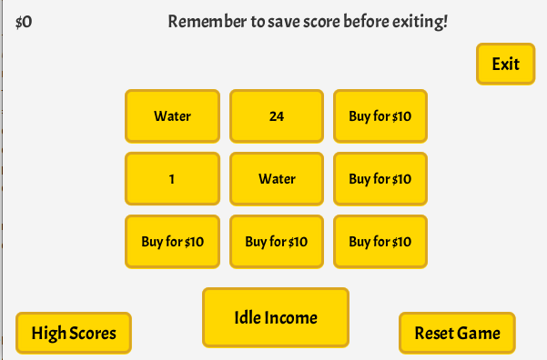

# Harvest Game
Harvest Game is a video game where the player tries to acquire as much money as possible. In the game player can grow plants and invest in idle income. The core gameplay loop of the game is to sell the harvest and buy new plants. The game could be described as farming tycoon.

Project was made for class [TKT20002](https://studies.helsinki.fi/opintotarjonta/cur/hy-opt-cur-2021-31e1be8a-da83-4a6b-b59d-1920ad62f5f6).



## Documentation
[Instructions](https://github.com/jpasikainen/ot-harjoitustyo/blob/master/documentation/instructions.md)\
[Software Requirement Specification](https://github.com/jpasikainen/ot-harjoitustyo/blob/master/documentation/srs.md)\
[Architecture](https://github.com/jpasikainen/ot-harjoitustyo/blob/master/documentation/architecture.md)\
[Working Hours](https://github.com/jpasikainen/ot-harjoitustyo/blob/master/documentation/workinghours.md)

## Download & Play
Go to [Releases](https://github.com/jpasikainen/ot-harjoitustyo/releases) and download the release you wish or click [HERE](https://github.com/jpasikainen/ot-harjoitustyo/releases/download/viikko5/HarvestGame.zip) to download the latest release. Save the *HarvestGame.zip* file and extract it. To play the game, use command
```
java -jar HarvestGame.jar
```
in the extracted directory. Game has been tested on Java version 11.0.9.1 on various Ubuntu derivated Linux distributions.

## Command line commands
Run commands in *HarvestGame* directory.

### Generate .jar
For .jar to work, *database* folder must be in the same directory as the executable.
```
mvn package
```
If you encounter warnings / errors try
```
mvn clean package
```

### Run
```
mvn compile exec:java -Dexec.mainClass=harvestgame.core.Game
```
### Testing
Run tests:
```
mvn test
```
Create test coverage report:
```
mvn jacoco:report
```
View report by opening file *target/site/jacoco/index.html*

### Checkstyle
```
mvn jxr:jxr checkstyle:checkstyle
```
View report by opening file *target/site/checkstyle.html*
