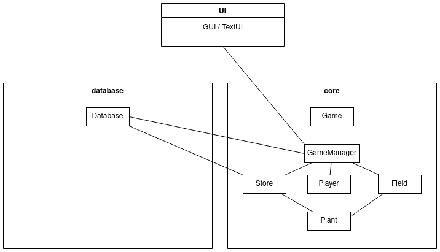

# Architecture
## Class Diagram

## GUI Startup
\
Program starts from the Game class. It calls static class GameManager's initialization method which in turn creates the "core" objects required to run the application.