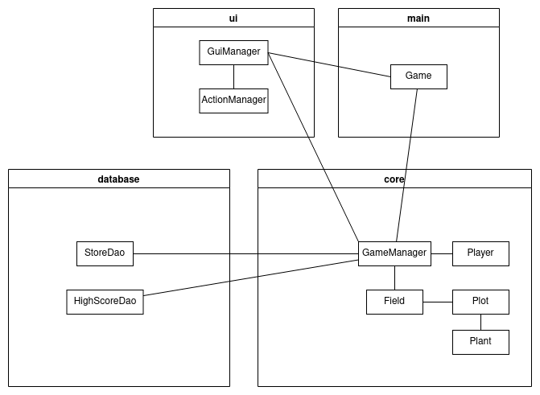
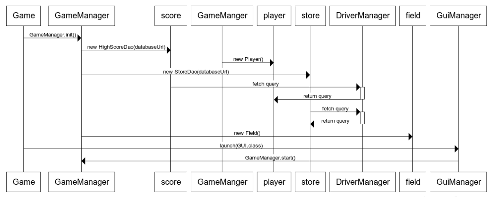
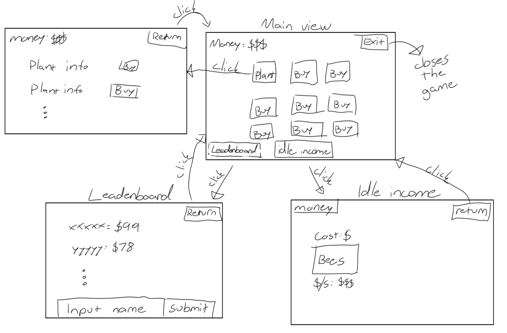

# Architecture
## Package structure

Ui package creates and controls the graphical interface. THe graphical interface itself is created using JavaFX11 and FXML. Styling is done with css and a custom font.

Core package takes care of the game logic and works without database access. Database (dao package) contains objects necessary to read and write the database. Database is stored in separate file *Database.db*.

## Functionality
### Plant lifecycle
Field contains plots and plots contain plants. Plants can be planted by first buying the plot and then buying a plant. Between each step player must press the plot button. On press, player's balance is checked. If the balance is sufficient, plant will be planted.

After planting, plant's growing time is decreased every second. GameManager takes care of the timer. Plant cannot be removed before its growing time reaches zero. After that it can be harvested. On harvest, plant is removed and player receives money. Now new plant can be planted.

### Leaderboard

### Idle income 

### GUI Startup
\
Program starts from the Game class. It calls static class GameManager's initialization method which in turn creates the "core" objects required to run the application. On the diagram above, the application is supposed have working access to the database.

## Database structure

Database.db contains all the necessary data for the game to function and is created with SQLite 3. It contains two tables, *Plants* and *HighScores*. The game can be broken or modified and expanded by accessing the database and changing values by any user.

*Plants* is used to store all the data required to create plants: id, name, price, soil_dryness, and growing_time. It is not written at any point of the lifecycle and only read at the startup.

*HighScores* contains the scores and names of the local users. Data is inserted to the table every time a new score is submitted.

## GUI structure

All the buttons' logic is located in ActionManager class. It contains all the mehthods that are called when buttons are pressed. On the other hand, GuiManager takes care of updating the visuals on the screen.

## Dependencies
* Junit 4.12: unit testing
* Checkstyle 2.17: used to check uniform coding style and clean code
* Javadoc 2.10.3: creates easy to view documentation
* Maven JXR 2.5: required by Checkstyle
* Maven Shade 1.6: used on .jar creation
* Jacoco 0.8.3: Generates readable test coverage report
* JavaFX Controls 11.0.1: Provides useful JavaFX elements
* JavaFXML 15: Makes creating JavaFX layouts easier
* SQLite 3.32.3.2: Provides controls to operate the SQLite database

