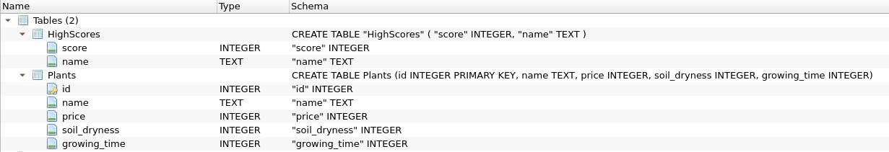

# Architecture
## Application structure

UI package creates and controls the graphical interface. Graphical interface is created using JavaFX11 and styled with css. Core package takes care of the game logic and contains the core classes. Database (dao package) contains objects necessary to read and write the database. Database is stored in separate file *workingdir/database/database.db*.

### Database structure

Database.db contains all the necessary data for the game to function and is created with SQLite 3. It contains two tables, *Plants* and *Player*. *Plants* is used to store all the data required to create plants: id, name, price, soil_dryness, and growing_time. *Player* contains the balance of the *Player*. The game can be broken or modified and expanded by accessing the database and changing values by any user.

## GUI Startup
\
Program starts from the Game class. It calls static class GameManager's initialization method which in turn creates the "core" objects required to run the application. On the diagram above, the application is supposed have working access to the database.
