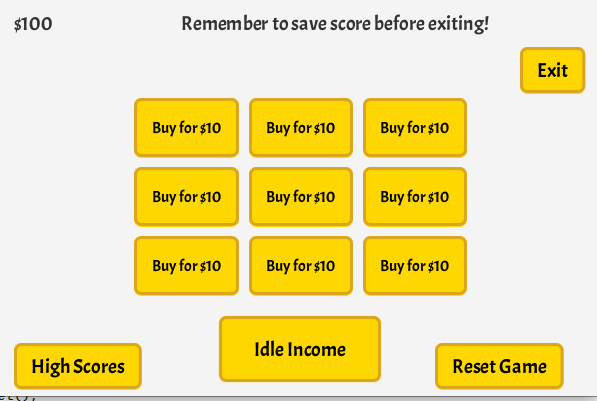

# Instructions
## Startup
Either generate jar or download a release and start the game. For more info, read [README.md](https://github.com/jpasikainen/ot-harjoitustyo/blob/master/README.md)

Make sure the running directory contains *database/Database.db*.

## How to play
1. Buy a plot by clicking one of the nine squares in the middle of the screen with text "Buy for $10"
2. Notice how your balance decreases to $90 and the plot's text changes to "Plant"
3. Click the same plot you previous clicked and a store view opens
4. Buy a plant you wish to plant. Experiment with different plants, they all are unique!
5. Notice how there is now a timer ticking on the plot. It tells how long it takes in seconds for the plant to grow
6. Wait for the plot's text to change to "Water" and click it to water the plant. Timer's time won't decrease until you do so
7. Repeat step 6 until the text has changed to "Harvest"
8. Click on the button and you receive money!
9. Now you can check out "Idle Income" screen by clicking a button with the exact text
10. If you have money, purchase "Bee hive". It generates money passively!
11. Repeat steps 1-8 until bored and click "High Scores" button
12. Write your name on the filed at the bottom and press submit
