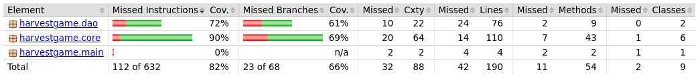

# Testing
Testing is done with JUnit
* Inteface testing is done manually
* Tests are divided on packages that are equivalent to the application pacakges
* DAO testing is pretty poor. No testing database is used

## Coverage

Function test coverage is 82% and branching coverage is 66%.

## Testing commands
Run tests:
```
mvn test
```
Create test coverage report:
```
mvn jacoco:report
```
View report by opening file *target/site/jacoco/index.html*

## Checkstyle
```
mvn jxr:jxr checkstyle:checkstyle
```
View report by opening file *target/site/checkstyle.html*
